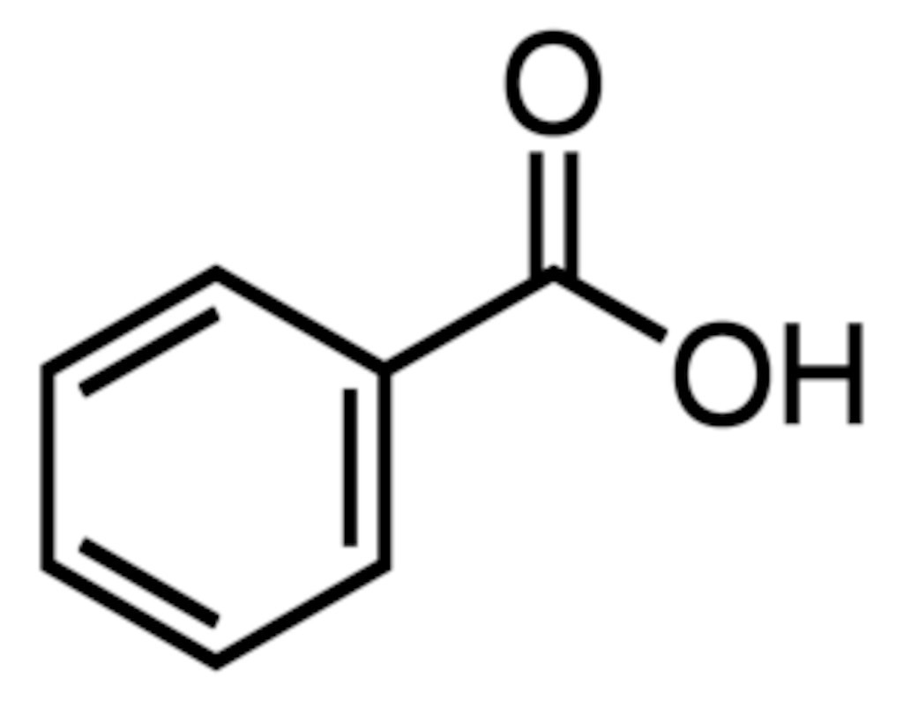
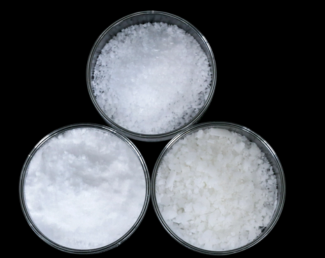
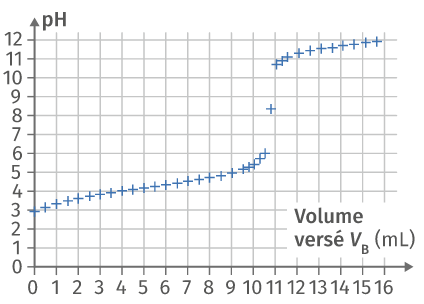
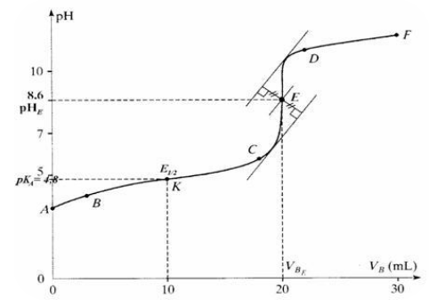
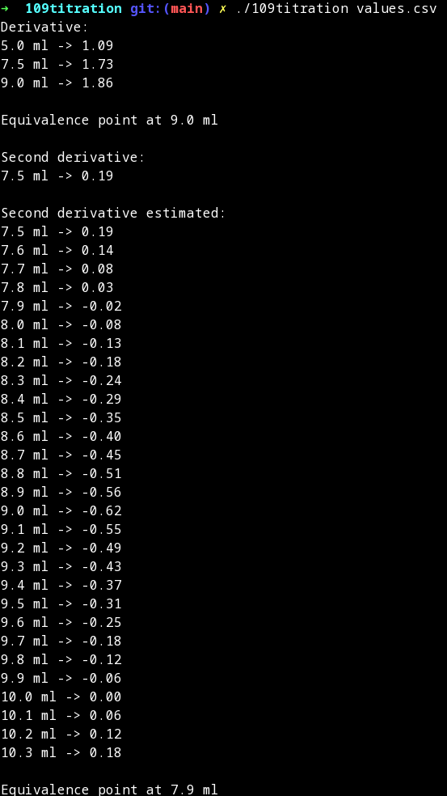
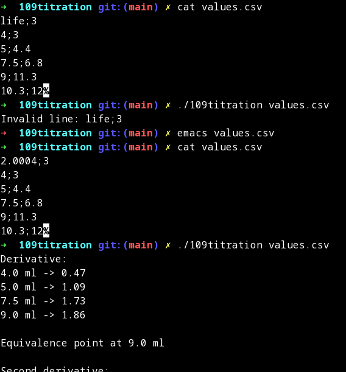

<div style="display: flex; align-items: center; justify-content: center;">
  <h1 style="font-size: 2em; font-weight: bold;">Concentration de l'acide benzoïque dans les sodas</h1>
  <span style="font-size: 2em; margin: 0 10px;">:left_right_arrow:</span>
  <h1 style="font-size: 2em; font-weight: bold;">Concentration of benzoic acid in soft drinks</h1>
</div>
<br>
<br>

```
   USAGE                                                                                                                                                                                 
        ./109titration <file>                                                                                                                                                                 
                                                                                                                                                                                              
   DESCRIPTION                                                                                                                                                                           
        file    a csv file containing "vol;ph" lines 
```

## Français

L'acide benzoïque est un conservateur alimentaire utilisé dans l'industrie sous le code E210. C'est un solide blanc et soyeux. 

<h2>E210 : molécule && forme solide</h2>
<span style="float: left; margin-right: 10px;">
  
</span>
<span style="float: left;">
  
</span>
<br>
<br>
Pour déterminer la concentration de cet additif dans un soda, on peut réaliser une titration pH : une base forte (le titrant) est ajoutée progressivement à un échantillon de soda (l'analyte), et le pH est ensuite lu. La courbe générée est typique, et comporte une zone où le pH augmente brutalement : il s'agit du saut de pH.
<br>
<br>


Pour trouver la concentration de conservateur dans le soda, il faut lire le volume de titrant ajouté au point d'équivalence (c'est-à-dire au milieu du saut de pH). Il existe deux approches principales pour le faire :

   - la méthode de la dérivée, qui consiste à calculer la dérivée de la courbe ; le point d'équivalence correspond au maximum de cette dérivée.

   - la méthode des tangentes parallèles, qui consiste à tracer deux tangentes parallèles à partir de deux parties différentes du saut de pH, puis à tracer une troisième droite perpendiculaire et équidistante des deux premières. Le point d'équivalence est à l'intersection de cette dernière droite et de la courbe.



Nous devions coder la première approche. Le programme doit lire le volume de titrant (en ml) et les couples pH à partir d'un fichier csv, et produire en sortie :

   - les valeurs de dérivée pour chaque volume donné,

   - le point le plus proche du point d'équivalence parmi les points donnés,

   - les valeurs de la deuxième dérivée pour chaque volume donné

   - une estimation des valeurs de la deuxième dérivée tous les 0,1 ml autour du point le plus proche du point d'équivalence ci-dessus, en utilisant une interpolation linéaire,

   - le point d'équivalence approprié, estimé à partir de la deuxième dérivée.

<figure>
  
  <figcaption>Sortie du programme</figcaption>
</figure>
<br>
<br>
<figure>
  
  <figcaption>Sortie du programme avec erreur</figcaption>
</figure>
<br>
<br>

Le code contient une gestion d'erreur personnalisée appelée InvalidFile et des fonctions utilisées pour lire les données d'un fichier CSV, effectuer des calculs et imprimer les résultats sur la console.  

   - La fonction check_args() vérifie les arguments de la ligne de commande et affiche des messages d'aide ou d'erreur en conséquence.

   - La fonction file_in_tab() lit le fichier CSV, vérifie les erreurs de formatage et retourne une erreur InvalidFile s'il n'y a pas assez de données. 

   - La fonction my_math() effectue les calculs mathématiques sur les données et affiche les résultats sur la console.


## English

Benzoic acid is a food preservative used in industry under the code E210. It's a white, silky solid. 

<h2>E210 : molecule && solid form</h2>
<span style="float: left; margin-right: 10px;">
  
</span>
<span style="float: left;">
  
</span>
<br>
<br>
To determine the concentration of this additive in a soda, a pH titration can be performed: a strong base (the titrant) is added progressively to a soda sample (the analyte), and the pH is then read. The curve generated is typical, and includes an area where the pH rises sharply: this is the pH jump.
<br>
<br>


To find the concentration of preservative in the soda, the volume of titrant added at the equivalence point (i.e. in the middle of the pH jump) must be read. There are two main approaches to doing this:

   - the derivative method, which consists of calculating the derivative of the curve; the equivalence point corresponds to the maximum of this derivative.

   - the parallel tangent method, which consists of drawing two parallel tangents from two different parts of the pH step, and then drawing a third line perpendicular and equidistant from the first two. The equivalence point is at the intersection of this last line and the curve.


We had to code the first approach. The program must read the volume of titrant (in ml) and the pH pairs from a csv file, and produce as output :

   - the derivative values for each given volume,

   - the closest point to the equivalence point among the given points,

   - the values of the second derivative for each given volume

   - an estimate of the values of the second derivative every 0.1 ml around the point closest to the equivalence point above, using linear interpolation,

   - the appropriate equivalence point estimated from the second derivative.

<figure>
  
  <figcaption>Program's output</figcaption>
</figure>
<br>
<br>
<figure>
  
  <figcaption>Program's output with error</figcaption>
</figure>
<br>
<br>

The code contain a custom error_handling called InvalidFile and functions that are used to read data from a CSV file, perform calculations on it, and print the results to the console.  

   - The check_args() function checks the command line arguments and displays help or error messages accordingly.

   - The file_in_tab() function reads the CSV file, checks for formatting errors and raises an InvalidFile exception if there is not enough data. 

   - The my_math() function performs mathematical calculations on the data and prints the results to the console.
